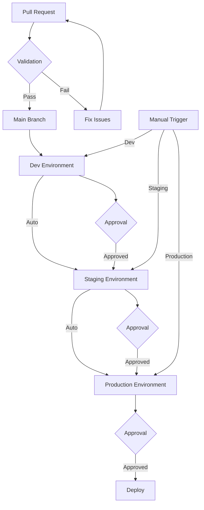

# Terraform Multi-Cloud GitOps Template

A production-ready Terraform template for managing multi-cloud infrastructure using GitOps principles, with built-in security scanning and compliance checks.

## Features

- **Multi-Cloud Support**
  - Google Cloud Platform (GCP)
  - Amazon Web Services (AWS)
  - Microsoft Azure
  - Provider-specific modules and configurations

- **GitOps Workflow**
  - Environment promotion (dev → staging → prod)
  - Automated deployments
  - Pull request-based changes
  - State management per environment

- **Security & Compliance**
  - Pre-commit hooks for code quality
  - Automated security scanning (TFSec, Checkov)
  - Infrastructure linting (TFLint)
  - Compliance checking
  - Environment-specific security rules

## Cloud Provider Credentials Setup

This template requires credentials for each cloud provider you plan to use. Follow these steps to configure the credentials in GitHub:

### 1. Create GitHub Environments

First, create environments in your GitHub repository:

1. Go to your repository settings
2. Navigate to "Environments"
3. Create three environments:
   - `dev`
   - `staging`
   - `prod`

### 2. Configure AWS Credentials

For each environment, add these AWS secrets:

```bash
AWS_ACCESS_KEY_ID: [your-aws-access-key]
AWS_SECRET_ACCESS_KEY: [your-aws-secret-key]
AWS_REGION: [your-aws-region]
```

To create AWS credentials:
1. Go to AWS IAM Console
2. Create a new IAM user or use an existing one
3. Attach necessary permissions (e.g., `AdministratorAccess` or custom policy)
4. Create access keys
5. Add the keys as secrets in GitHub

### 3. Configure GCP Credentials

For each environment, add this GCP secret:

```bash
GOOGLE_CREDENTIALS: [your-service-account-key-json]
```

To create GCP credentials:

1. Install and initialize the Google Cloud CLI:
   ```bash
   # Install gcloud CLI (if not already installed)
   # For macOS:
   brew install google-cloud-sdk

   # Initialize gcloud
   gcloud init
   ```

2. Create a Service Account:
   ```bash
   # Replace ${PROJECT_ID} with your GCP project ID
   gcloud iam service-accounts create "github-actions" \
     --project "${PROJECT_ID}"
   ```

3. Create a Service Account Key:
   ```bash
   # Replace ${PROJECT_ID} with your GCP project ID
   gcloud iam service-accounts keys create "key.json" \
     --iam-account "github-actions@${PROJECT_ID}.iam.gserviceaccount.com"
   ```

4. Grant necessary roles to the service account:
   ```bash
   # Replace ${PROJECT_ID} with your GCP project ID
   gcloud projects add-iam-policy-binding ${PROJECT_ID} \
     --member="serviceAccount:github-actions@${PROJECT_ID}.iam.gserviceaccount.com" \
     --role="roles/editor"
   ```

5. Add the key to GitHub:
   - Open the generated `key.json` file
   - Copy its entire contents
   - Go to GitHub repository settings > Environments > [environment] > Add secret
   - Name: `GOOGLE_CREDENTIALS`
   - Value: Paste the entire JSON content

### 4. Configure Azure Credentials

For each environment, add this Azure secret:

```bash
AZURE_CREDENTIALS: [your-service-principal-credentials]
```

To create Azure credentials:

1. **Register an Application in Microsoft Entra ID**:
   1. Sign in to the [Microsoft Entra admin center](https://entra.microsoft.com)
   2. Go to **Entra ID** > **App registrations**
   3. Select **New registration**
   4. Enter a name (e.g., "GitHubActions")
   5. Under **Supported account types**, select "Accounts in this organizational directory only"
   6. Click **Register**

2. **Assign a Role to the Application**:
   1. Go to **Azure portal** > **Subscriptions**
   2. Select your subscription
   3. Go to **Access control (IAM)**
   4. Click **Add** > **Add role assignment**
   5. Select the role (e.g., "Contributor")
   6. Click **Next**
   7. Under **Assign access to**, select "User, group, or service principal"
   8. Click **Select members** and find your application
   9. Click **Review + assign**

3. **Create a Client Secret**:
   1. Go back to your app registration
   2. Select **Certificates & secrets**
   3. Click **Client secrets** > **New client secret**
   4. Add a description and select an expiration
   5. Click **Add**
   6. **IMPORTANT**: Copy the secret value immediately - it won't be shown again

4. **Get Required Values**:
   - Go to your app's overview page
   - Copy these values:
     - Application (client) ID
     - Directory (tenant) ID
     - The client secret you just created
     - Your subscription ID

5. **Create the Credentials JSON**:
   ```json
   {
     "clientId": "your-application-client-id",
     "clientSecret": "your-client-secret",
     "subscriptionId": "your-subscription-id",
     "tenantId": "your-tenant-id"
   }
   ```

6. **Add to GitHub**:
   - Go to GitHub repository settings > Environments > [environment] > Add secret
   - Name: `AZURE_CREDENTIALS`
   - Value: Paste the entire JSON object

Note: The client secret is only shown once when created. Make sure to save it securely. If you lose it, you'll need to create a new one.

For more detailed information, refer to the [official Microsoft documentation](https://learn.microsoft.com/en-us/entra/identity-platform/howto-create-service-principal-portal).

### 5. Verify Credentials

The workflow includes debug steps that will show if credentials are properly configured. You should see:

```bash
Environment: dev
AWS_ACCESS_KEY_ID: ***
AWS_SECRET_ACCESS_KEY: ***
AWS_REGION: ***
GOOGLE_CREDENTIALS: ***
AZURE_CREDENTIALS: ***
```

If any shows "NOT SET", that secret needs to be configured.

### 6. Environment Protection Rules (Optional)

For each environment, you can configure:
- Required reviewers
- Wait timer
- Branch restrictions
- Deployment branch rules

## Repository Structure

```
.
├── environments/           # Environment-specific configurations
│   ├── dev/               # Development environment
│   ├── staging/           # Staging environment
│   └── prod/              # Production environment
├── modules/               # Reusable Terraform modules
│   ├── gcp/              # GCP-specific modules
│   ├── aws/              # AWS-specific modules
│   └── azure/            # Azure-specific modules
├── .github/              # GitHub Actions workflows
├── .pre-commit-config.yaml # Pre-commit hooks configuration
├── .tflint.hcl           # TFLint configuration
├── .tfsec.yml            # TFSec configuration
├── .gitignore           # Git ignore rules
└── README.md            # This file
```

## Infrastructure Scanning

This template includes several infrastructure scanning tools to ensure code quality and security:

### Pre-commit Hooks

The repository uses pre-commit hooks to automatically check code quality before commits:

```bash
# Install pre-commit
pip install pre-commit

# Install the hooks
pre-commit install
```

The following checks are performed:
- Terraform formatting
- Terraform validation
- Terraform documentation
- TFLint checks
- TFSec security scanning
- Checkov compliance checks

### Scanning Tools

1. **TFLint**
   - Lints Terraform code
   - Checks for best practices
   - Provider-specific rules

2. **TFSec**
   - Security scanning
   - Misconfiguration detection
   - Compliance checking

3. **Checkov**
   - Infrastructure as Code scanning
   - Security and compliance
   - Custom policy support

### GitOps Workflow

1. All infrastructure changes are made through pull requests
2. Changes are first applied to the dev environment
3. After validation, changes are promoted to staging
4. Finally, changes are promoted to production
5. Each environment has its own state file and configuration

### Getting Started

1. Clone this repository
2. Copy the template to your new project
3. Update the environment-specific variables in each environment directory
4. Initialize Terraform in your target environment:
   ```bash
   cd environments/dev
   terraform init
   ```

### Environment Promotion

To promote changes between environments:

1. Create a pull request from dev to staging
2. After approval and successful deployment to staging
3. Create a pull request from staging to production
4. Follow the same process for production deployment

### Security

- Each environment uses separate state files
- Sensitive variables are stored in a secure vault
- Access to production requires additional approvals
- Automated security scanning in CI/CD pipeline

### Contributing

1. Create a feature branch from dev
2. Make your changes
3. Run pre-commit hooks:
   ```bash
   pre-commit run --all-files
   ```
4. Create a pull request
5. Wait for review and approval
6. Merge to dev and follow the promotion process

## License

This project is licensed under the MIT License - see the LICENSE file for details.

## Workflow Process

The following diagram illustrates the workflow process:


