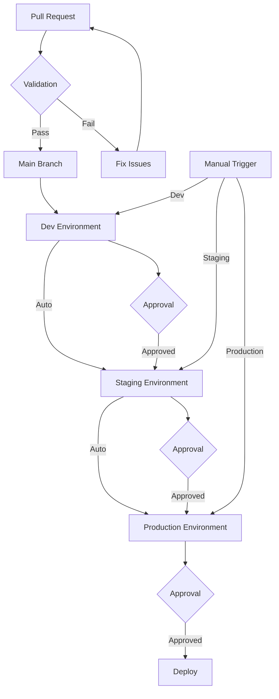

# Terraform Multi-Cloud GitOps Template

A production-ready Terraform template for managing multi-cloud infrastructure using GitOps principles, with built-in security scanning and compliance checks.

## Features

- **Multi-Cloud Support**
  - Google Cloud Platform (GCP)
  - Amazon Web Services (AWS)
  - Microsoft Azure
  - Provider-specific modules and configurations

- **GitOps Workflow**
  - Environment promotion (dev → staging → prod)
  - Automated deployments
  - Pull request-based changes
  - State management per environment

- **Security & Compliance**
  - Pre-commit hooks for code quality
  - Automated security scanning (TFSec, Checkov)
  - Infrastructure linting (TFLint)
  - Compliance checking
  - Environment-specific security rules

## Repository Structure

```
.
├── environments/           # Environment-specific configurations
│   ├── dev/               # Development environment
│   ├── staging/           # Staging environment
│   └── prod/              # Production environment
├── modules/               # Reusable Terraform modules
│   ├── gcp/              # GCP-specific modules
│   ├── aws/              # AWS-specific modules
│   └── azure/            # Azure-specific modules
├── .github/              # GitHub Actions workflows
├── .pre-commit-config.yaml # Pre-commit hooks configuration
├── .tflint.hcl           # TFLint configuration
├── .tfsec.yml            # TFSec configuration
├── .gitignore           # Git ignore rules
└── README.md            # This file
```

## Infrastructure Scanning

This template includes several infrastructure scanning tools to ensure code quality and security:

### Pre-commit Hooks

The repository uses pre-commit hooks to automatically check code quality before commits:

```bash
# Install pre-commit
pip install pre-commit

# Install the hooks
pre-commit install
```

The following checks are performed:
- Terraform formatting
- Terraform validation
- Terraform documentation
- TFLint checks
- TFSec security scanning
- Checkov compliance checks

### Scanning Tools

1. **TFLint**
   - Lints Terraform code
   - Checks for best practices
   - Provider-specific rules

2. **TFSec**
   - Security scanning
   - Misconfiguration detection
   - Compliance checking

3. **Checkov**
   - Infrastructure as Code scanning
   - Security and compliance
   - Custom policy support

### GitOps Workflow

1. All infrastructure changes are made through pull requests
2. Changes are first applied to the dev environment
3. After validation, changes are promoted to staging
4. Finally, changes are promoted to production
5. Each environment has its own state file and configuration

### Getting Started

1. Clone this repository
2. Copy the template to your new project
3. Update the environment-specific variables in each environment directory
4. Initialize Terraform in your target environment:
   ```bash
   cd environments/dev
   terraform init
   ```

### Environment Promotion

To promote changes between environments:

1. Create a pull request from dev to staging
2. After approval and successful deployment to staging
3. Create a pull request from staging to production
4. Follow the same process for production deployment

### Security

- Each environment uses separate state files
- Sensitive variables are stored in a secure vault
- Access to production requires additional approvals
- Automated security scanning in CI/CD pipeline

### Contributing

1. Create a feature branch from dev
2. Make your changes
3. Run pre-commit hooks:
   ```bash
   pre-commit run --all-files
   ```
4. Create a pull request
5. Wait for review and approval
6. Merge to dev and follow the promotion process

## License

This project is licensed under the MIT License - see the LICENSE file for details.

## Workflow Process

The following diagram illustrates the workflow process:


